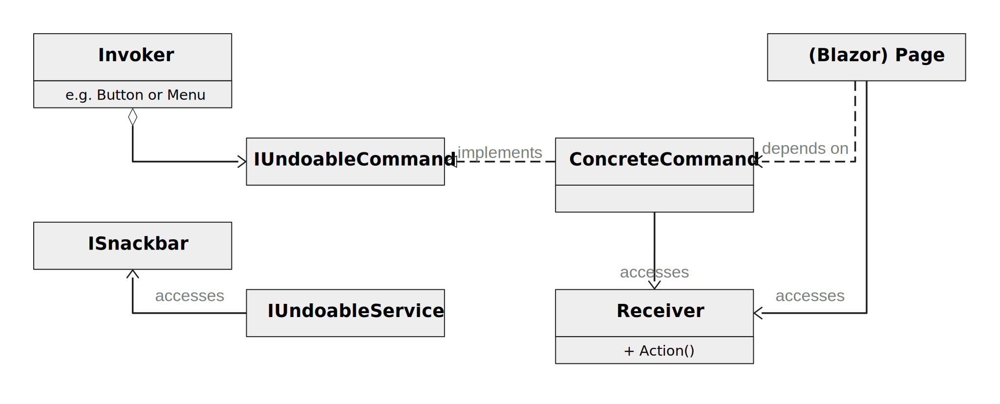

# rapdundo

## Why is Undo important?

The ISO 9241-110 "Dialog Principles" states 6 criteria for a favourable dialog between user and a device. One of them is *error tolerance*. All effort invested into Undo directly pays into error tolerance.

One reason could be the requirement of intuitive interfaces. If the interface is intuitive - so the assumption of many people - users clearly understand what they do on every step. But, of course, that reasoning falls short. For one thing there will never be an App that is 100% intuitive for just about everybody. There will always be a certain level of trial and error. People learn the App by trying things out. Some user groups need this more than others. But even the best designed App must forgive a human error. 

We also should not forget that users make different kinds of errors. If users do very well understand the interface and have the right intention things can still go wrong. The psychology of human error distinguishes several types: mistakes, slips, and lapses. Simply put:

* **Mistakes** happen because someone does not know to do the right thing.
* That means that someone who **slips** knows what to do but they still don't. Examples: press a neighbouring button on a touch interface; 
* When users forget to do something or lose their place midway through a task that is called a **lapse**. Such things easily happen when they get interrupted during a task.

How does undo help? It helps for each of these types. It helps with mistakes because users can trust your app and they know: it won't be a problem to try that feature, because I can always undo any havoc I might wreak with one simple click. Mistakes can easily be undone and it encourages users to be curious about your app and learn it fast, try out new features as they come out and become an expert. This way undo does not only pay into dialog principle *error tolerance* but also *learnability*. There are other features like previews that can further increase learnibility and help avoid or recover from mistakes.

Of course, it helps with slips. Users have the chance to go back one step and recover quickly. [Other features (see e.g. Laubheimer, 2015b)](https://www.nngroup.com/articles/slips/)) can help, too, but undo is the most universal one.

## Where has it gone?

For some time in the last 25 years undo had become a standard. It came up in the early 70-ies and became more and more standard. The multilevel undo emerged in the 80ies. 

But then it got lost again. I can only speculate why it happened. In my professional career I had a number of conversations that may give some pointers. Discussions were about data base applications that write everything directly into the base. Every action had been logged with a time stamp and could litterally not be undone. But - of course - there is no reason why an undo could not have helped to remove a wrong data entry from the data base so that the user can correct it. Also mobile apps became a standard including the (overused) mobile first paradigm. And there is hardly enough screen space for the tasks themselves. Where could you possibly put the undo?

I suspect that many UX designers except myself still advocated undo but somehow it did not survive the implementation phase.

## Overview

The implementation is based on the [Command pattern (see Wikipedia)](https://en.wikipedia.org/w/index.php?title=Command_pattern&oldid=1025768927). The classes and objects participating here include:

* The invoker asks the command to carry out the request. These are menu items, buttons, ... They can be based on [`ICommandSource`](https://docs.microsoft.com/en-us/dotnet/api/system.windows.input.icommandsource).
* The receiver is the object that performs the operations that are needed to carry out the command.
* `IUndoableCommand` declares an interface for executing an operation. It is derived from [`ICommand`](https://docs.microsoft.com/en-us/dotnet/api/system.windows.input.icommand.canexecutechanged).
* The **(Concrete) Command** links the invoker to the receiver
  * defines a binding between a receiver object and an action
  * implements `Execute()` by invoking the corresponding operation(s) on the receiver
* `IUndoableService`
  * `ISnackbar` is the MudBlazor service. With [Snackbars](https://mudblazor.com/components/snackbar) the toolkit has a UI for rapdUndo commands.

## Sources

* ISO (2020). ISO 9241-110:2020 Ergonomics of human-system interaction — Part 110: Interaction principles.
* Laubheimer, Page (2015a). "[Preventing User Errors: Avoiding Conscious Mistakes](https://www.nngroup.com/articles/user-mistakes/)". Accessed 2021-07-25.
* Laubheimer, Page (2015b). "[Preventing User Errors: Avoiding Unconscious Slips](https://www.nngroup.com/articles/slips/)".  Accessed 2021-07-25.

