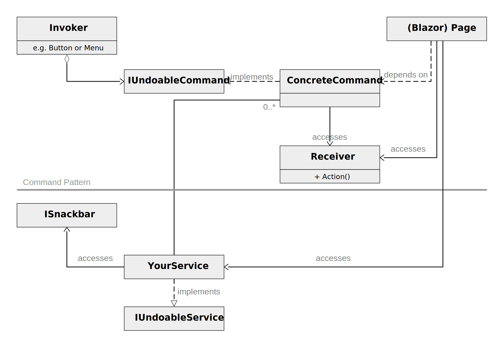

# rapdundo

> ## This is work in progress...


## Why is Undo important?

The ISO 9241-110 "Dialog Principles" states 6 criteria for a favourable dialog between user and a device. One of them is *error tolerance*. All effort invested into Undo directly pays into error tolerance. There will always be a certain level of trial and error. People learn the App by trying things out. Some user groups need this more than others. But even the best designed App must forgive a human error and help users recover quickly.

Users make different kinds of errors. That is indeed noteworthy. If users do very well understand the interface and have the right intention things can still go wrong. The psychology of human error distinguishes several types: mistakes, slips, and lapses. Simply put:

* **Mistakes** happen because someone does not know to do the right thing.
* That means that someone who **slips** knows what to do but they still don't. Examples: press a neighbouring button on a touch interface; or you click "save" when what you actually wanted was "save as...".
* When users forget to do something or lose their place midway through a task that is called a **lapse**. Such things easily happen when they get interrupted during a task.

How does undo help? It helps for each of these types. It helps with mistakes because users can trust your app and they know: it won't be a problem to try that feature, because I can always undo any havoc I might wreak with one simple click. Mistakes can easily be undone and it encourages users to be curious about your app and learn it fast, try out new features as they come out and become an expert. This way undo does not only pay into dialog principle *error tolerance* but also *learnability*. There are other features like previews that can further increase learnibility and help avoid or recover from mistakes.

Of course, it helps with slips. Users have the chance to go back one step and recover quickly. [Other features (see e.g. Laubheimer, 2015b)](https://www.nngroup.com/articles/slips/)) can help, too, but undo is the most universal one.


## Where has it gone?

For some time in the last 50 years undo had become a standard. It came up in the early 70-ies and became increasingly important. The multilevel undo emerged in the 80ies.

But then it got lost again. I do not seem to be the only one who noticed it. A "distant colleague" wrote in 2007: "Undo functionality seems to be in increasingly short supply on the more recent raft of web 2.0. websites, especially on sites that make heavy use of AJAX".

I can only speculate why it happened. In my professional career I had a number of conversations that may give some pointers. Discussions were about data base applications that write everything directly into the base. Every action had been logged with a time stamp and could litterally not be undone. But - of course - there is no reason why an undo could not have helped to remove a wrong data entry from the data base so that the user can correct it. Also mobile apps became a standard including the (overused) mobile first paradigm. And there is hardly enough screen space for the tasks themselves. Where could you possibly put the undo? and, finally, one reason could be the "requirement" of intuitive interfaces. At least I hear that a lot. Product managers want their app to be intuitive. If the interface is intuitive - so the assumption - users clearly understand what they do on every step. But if that is true and people know what to do on every step, is there a need for undo? The previous section made the case: yes, even if there was an overall intuitive interface, we would still need undo. But we would probably would not need it that much.

I suspect that many UX designers except myself still advocated undo but somehow it did not survive the implementation phase.


## How to use it

I use it for actions that are directly elicited on a user's action. Commands that are easy to trigger but it is for users  difficult to recover from their effects.

I do not use it
* ... for actions caused by the commit of a modal windows (dialog or light box).
* ... for actions that do not have lasting consequences, like applying a filter to a table. 

But that is only part of it. You need a recovery philosophy, in general and that includes a concept which actions offer undo and which do not. And please note: it does not need to be clear to you. And must be clear to your users. It is perfectly okay if your developers need to take a look at the coding guidelines every time they implement a command. It is not okay if your users need to look it up.


## Implementation Overview



The implementation is based on the [Command pattern (see Wikipedia)](https://en.wikipedia.org/w/index.php?title=Command_pattern&oldid=1025768927). The classes and objects participating here include:

* The invoker asks the command to carry out the request. These are menu items, buttons, ... They can be based on [`ICommandSource`](https://docs.microsoft.com/en-us/dotnet/api/system.windows.input.icommandsource).
* The receiver is the object that performs the operations that are needed to carry out the command.
* `IUndoableCommand` declares an interface for executing an operation. It is derived from [`ICommand`](https://docs.microsoft.com/en-us/dotnet/api/system.windows.input.icommand.canexecutechanged).
* The **(Concrete) Command** links the invoker to the receiver
  * defines a binding between a receiver object and an action
  * implements `Execute()` by invoking the corresponding operation(s) on the receiver
* `IUndoableService`
  * `ISnackbar` is the MudBlazor service. With [Snackbars](https://mudblazor.com/components/snackbar) the toolkit has a UI for rapdUndo commands.


## Add rapdundo to Your App

Add the following 
```C#
builder.Services.AddScoped<IUndoableService, UndoableService>();
```

to either

* `Program.Main` for Blazor **WebAssembly** or
* `Startup.cs` under `ConfigureServices` for Blazor **Server**.

...TBD...


## Use rapdundo on Blazor Pages

For this sample the sample command `PropertySetterUndoCommand<T1, T2>` is used. This command allows you to set any public property of any class. `T1` represents the class, `T2` the type of the property.

Option 1: 

```C#
@code {
    public int currentCount { get; set; } = 0; // must be accessible from outside for the command to change it

    public PropertySetterUndoCommand<Counter, int> CmdCount;

    protected override void OnInitialized()
    {
        CmdCount = new(this, nameof(currentCount), currentCount + 1);
        Undo.Register(CmdCount);
    }

    // Bind this to the `OnClick` event of your button
    private void IncrementCount()
    {
        CmdCount.Execute();
    }
}
```


## Write Your Own Commands


Derive your command from `UndoableCommandBase`.

```C#
public class MyCommand : UndoableCommandBase
{}
```


Provide two methods (`CanExecute` and `CanRevoke`) that allow you to check whether the command can be executed or evoked in the current state.

```C#
public override bool CanExecute(object? parameter = null) => SomeCondition == true;
```


Finally, provide the methods that execute and revoke the command, respectively. Here is `Èxecute` as example.

```C#
public override void Execute(object? parameter = null)
{
  // Do your thing
  ...
  // Notify any listeners that the command was executed
  NotifyExecution(parameter);
  // Notify any listeners that CanRevoke() has changed 
  // ... because now there is an executed command that can be undone
  NotifyOnCanRevokeChanged(this, new CmdExecEventArgs());
}
```

## Sources

* ISO (2020). [ISO 9241-110:2020 Ergonomics of human-system interaction — Part 110: Interaction principles](http://www.iso.org/iso/iso_catalogue/catalogue_tc/catalogue_detail.htm?csnumber=52075). Accessed 2021-07-25.
* Laubheimer, Page (2015a). "[Preventing User Errors: Avoiding Conscious Mistakes](https://www.nngroup.com/articles/user-mistakes/)". Accessed 2021-07-25.
* Laubheimer, Page (2015b). "[Preventing User Errors: Avoiding Unconscious Slips](https://www.nngroup.com/articles/slips/)". Accessed 2021-07-25.
* Boag, Paul  (2007). [The importance of Undo](https://boagworld.com/usability/the-importance-of-undo/). Accessed 2021-07-25.
